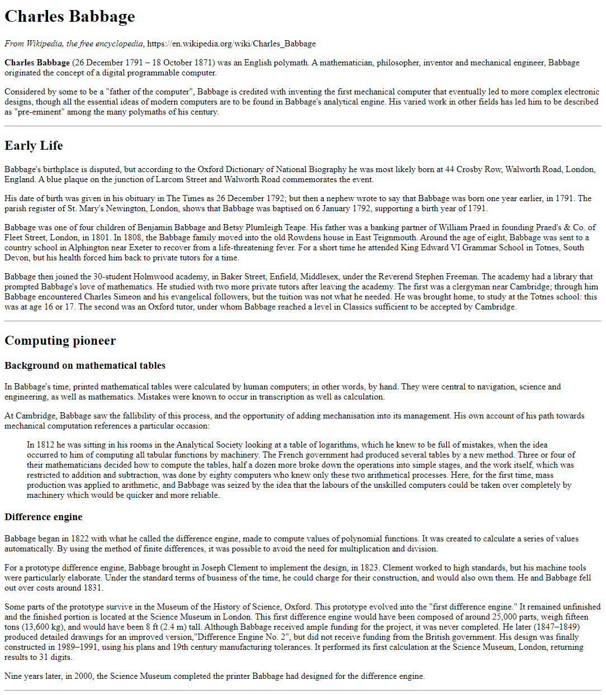
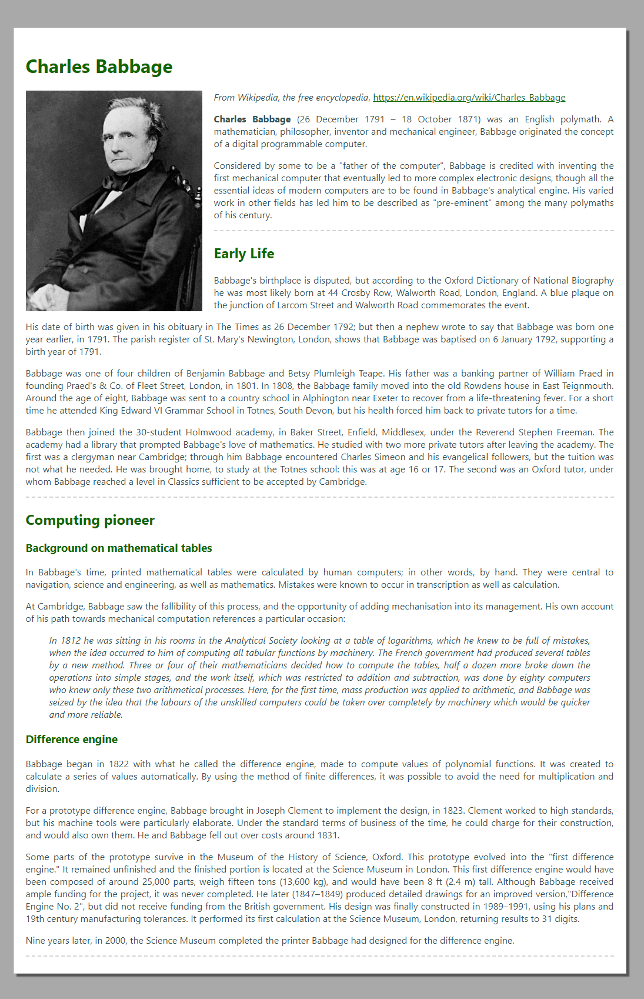
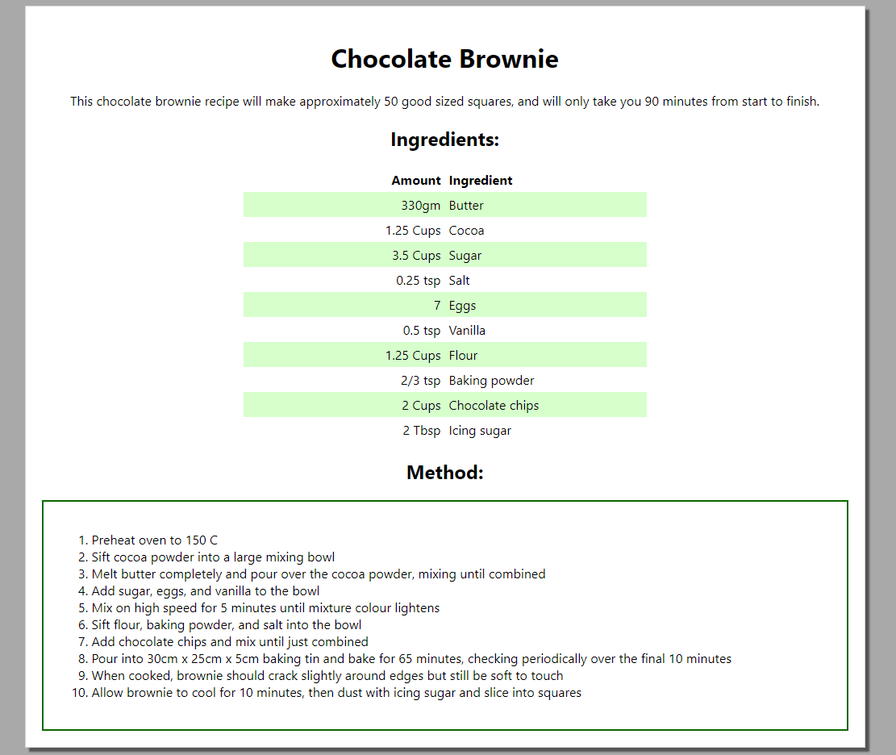

# Session One - HTML & Basic CSS
In this session, you will learn:
- The structure of HTML & CSS documents
- How to add HTML elements to a page
- Lists, Tables, Hyperlinks, Images, etc.
- CSS colors, fonts, borders, margins, padding, selectors


## Online resources
The following websites may be useful resources for you when completing these exercises:

- [MDN intro to HTML](https://developer.mozilla.org/en-US/docs/Web/HTML)

  - [MDN HTML Table documentation](https://developer.mozilla.org/en-US/docs/Web/HTML/Element/table)

- [MDN Intro to CSS tutorial](https://developer.mozilla.org/en-US/docs/Learn/Getting_started_with_the_web/CSS_basics)

  - [MDN CSS reference](https://developer.mozilla.org/en-US/docs/Web/CSS)

  - [CSS box model](https://developer.mozilla.org/en-US/docs/Web/CSS/CSS_Box_Model/Introduction_to_the_CSS_box_model)

  - [CSS selectors](https://developer.mozilla.org/en-US/docs/Web/CSS/Reference#Selectors)

  - [Image floats](https://developer.mozilla.org/en-US/docs/Web/CSS/float)

## Exercise 01 - Famous computer scientists
In the `01-famous-people` folder, you'll see three HTML files, each one corresponding to a famous computer scientist. In this exercise, we'll complete Charles Babbage's content, then style the pages to be more interesting.

### a) Adding Charles Babbage's HTML
You'll notice that `charles_babbage.html` is a lot sparser than the other two HTML files. Our first step will be to rectify this!

Also provided is a text file called `charles_babbage.txt`, containing the content intended to be added to his page. Copy that content over to the HTML file, and appropriately apply headings (i.e. `<h1>`, `<h2>`, etc), paragraphs (i.e. `<p>`), and other elements such as `<a>`, `<blockquote>`, `<hr>` to get the page looking like the screenshot below (which can also be seen in `spec/babbage-no-css.png`). Use the screenshot, as well as the other HTML files in the folder, as a guide.

*Hint:* The paragraph beginning *"In 1812, he was sitting..."* should be a block quote.



### b) Adding images
In the `assets` folder, you'll notice an image corresponding to each famous person. At the top of each person's page (just below the main heading), add each person's image.

### c) Page styling
Now, let's add some CSS to make our page look nicer! In the `css` folder, you'll notice an empty CSS file called `famous.css`. Begin by adding a `<link>` to that file in each HTML page. At this time, to make styling easier, also surround all the page contents with a `<div>`, and give it the class name `container`. For example, the structure of `grace_hopper.html` after this change might be:

```html
<body>
    <div class="container">
        <h1>Grace Hopper</h1>
        ...
        <!-- More content here -->
        ...
        <hr />
    </div>
</body>
```

Now, add CSS rules to `famous.css` to get your HTML pages looking as you would like. **As a suggestion**, follow these steps to try and get your pages looking like the screenshot below (`babbage-with-css.png`) - but if you'd rather tweak these steps create your own completely new design, go right ahead!

As you code, regularly check your page in a browser to see how it looks.

- The page body should have no margin, a dark gray background color, and `'Segoe UI'` font. If that font is not available, the fallbacks should be `Tahoma`, `Geneva`, `Verdana`, and `sans-serif`, in decreasing priority.

- The div you added with the `container` class should be `1000px` wide. It should have a `50px` top and bottom margin, and an `auto` left and right margin (which will cause it to be centered). It should have `20px` of padding on all sides.

- The container div should have a white background, a `1px` solid light gray border, and should have a `box-shadow` of `5px` by `5px`, blurred by `2px`, with a color of `rgba(0, 0, 0, 0.5)` **Hint:** Check out the MDN documentation for `box-shadow` if you're stuck.

- All paragraphs and block quotes should have their text justified and dark slate gray in color. Block quotes should additionally be in italics.

- All headings should be dark green.

- Links should also be dark green when they have been visited, but light green when they have not.

- The horizontal rules should have a `2px` dashed light gray top border, and should have no border on any other side.

- The main images should be floated to the left, and have `20px` right and `5px` bottom margins. They should be `300px` wide. Apply these styles in such a way that if we add more images to the page in the futer, they *won't* have these styles applied. **Hint:** You may need to modify the HTML files for this.



### d) Important sections
Finally, we would like to be able to highlight important sections on each page. Think about how you might want an "important" section to look, and how you'll allow website editors to apply these styles (one possibility, for example, is to have editors surround important sections with some kind of div with an `important` class applied).

Once you've written your CSS, use it to highlight one or more sections on each HTML page.


## Exercise 02 - Recipes

In the `02-recipes` folder, you will find a text file which contains unformatted content in the form of a recipe that you will transform into a styled webpage. Create an HTML and CSS file to hold the content / styles for this recipe page. Add elements to your page and style them so they look as close as possible to the screenshot below (and in this session's `spec` folder). **Hint:** The table styling will probably be the most challenging aspect here. Make appropriate use of online resources to guide you here.



Once you're done, feel free to embellis the page (or those from the previous exercise) with your own styles!