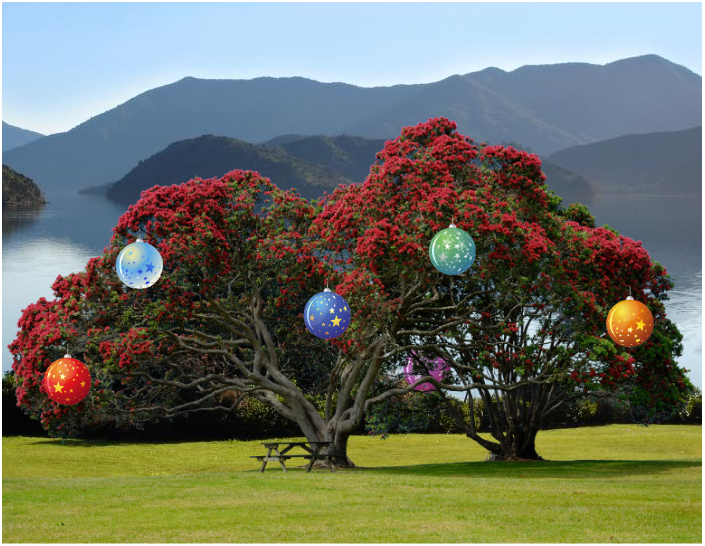
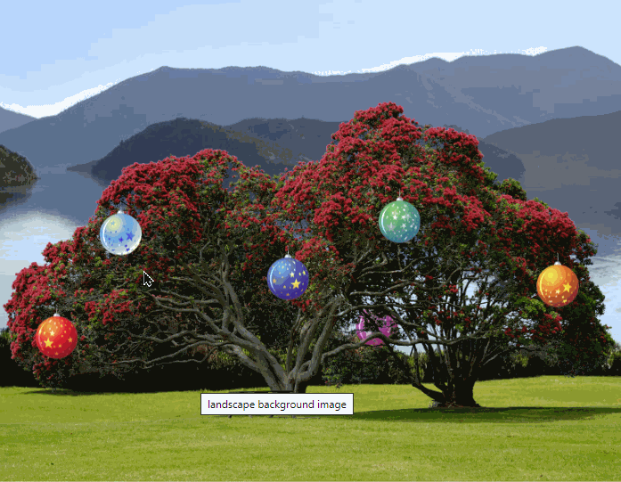
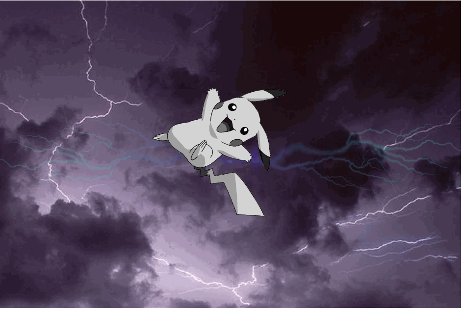

# Session Two - CSS Positioning & Animations
In this session, you'll learn
- CSS positioning
- CSS transitions
- CSS transformations
- CSS animations


## Online resources
The following websites may be useful resources for you when completing these exercises:
- [CSS image filters](https://developer.mozilla.org/en-US/docs/Web/CSS/filter)
- [CSS positioning](https://developer.mozilla.org/en-US/docs/Web/CSS/position)
- [CSS transitions](https://developer.mozilla.org/en-US/docs/Web/CSS/transition)
- [CSS transform property](https://developer.mozilla.org/en-US/docs/Web/CSS/transform)
- [CSS animations](https://developer.mozilla.org/en-US/docs/Web/CSS/CSS_Animations/Using_CSS_animations)

## Exercise 01 - A CSSmas tree

In this exercise, we'll decorate an image of a Christmas tree with baubles, and place it all over a nice New Zealand landscape photograph. You will find the files used in this exercise in the `01-xmas-tree` folder. Any HTML for this question should be placed in `christmas-tree.html`, and any associated CSS should be written in `christmas-tree.css`. Once we've tecorated the tree, we'll apply some transforms, transitions and animations to make things more exciting. An example of what your page may look like when complete is shown below.



### a) Decorating the tree

Begin by creating 8 `` elements in the document, displaying each of the 8 images in the `assets` directory. Give each image a meaningful id, and additionally give each of the colored ball images a common class. Style the 'background' image so that it sits in the middle of the web browser viewport. Using CSS, move the 'pohutukawa' image so that it sits on top of the background image, in such a way that makes it look like it is a part of the background.

Style the colored baubles so that they appear to be decoratively scattered over the tree. Update at least one of the baubles so that it appears *behind* the pohutukawa tree (see the pink bauble in the above screenshot for an example).

##### HINTS:
- You may find it useful to place all your images within a container `div` with relative or absolute positioning, so that any elements within it can position themselves absolutely with respect to its box.
- Use absolute positioning on the background to cover the entire div starting at the top left. The image shouldn't have to resize if you make the container div the same size as the background image.
- To make items appear on top of one-another, you will want to look into the `z-index` of the elements.


### b) Expanding baubles

Continuing on from *a)*, we will now style the baubles so that they expand when the user hovers over them with the mouse. This should be achieved using a *scale* *transform*.

Once you've done that, further modify your code such that the bauble moves smoothly between "small" and "large" states. Decide whether it would make sense to use a *transition* or an *animation* for this exercise. An example can be seen in the gif below (`expanding-baubles.gif`).



**Note:** Because one of the baubles has been styled so that it was behind the tree, you may notice that such a bauble doesn't respond to hover events. This is because the tree image, being in front of it, captures the hover event first. To change this default behaviour it is possible in CSS to set elements to ignore events from the mouse, stylus or touch - generically classified as *pointer events*. To get your tree image to ignore pointer events so that these events are passed on to elements behind the tree instead, add something like this:

```css
#tree {
	pointer-events: none;
}
```

Try using this to get hover events to work on any obscured baubles you have. For more information refer to <https://css-tricks.com/almanac/properties/p/pointer-events/>.


### c) We all fall down

To complete our CSSmas tree, we will use a CSS `@keyframes` animation to get the baubles to all fall down simultaneously and bounce up and down twice before coming to a standstill when the user hovers over the tree. The baubles should remain on the ground after the animation is complete. An example of what the completed animation might look like can be seen in the gif below (though the exact timings / bounce distance / etc. are up to you).


**Note:** *All* baubles should animate *at the same time*, whenever you hover over any part of the image. They shouldn't animate individually.

**Hints:**
- Think about how you'd style all your `.bauble` elements to include your animation, but *only* when you're *hovering* over the `#container`.
- Investigate the `animation-fill-mode` property to make the baubles stay on the ground.
- Do you need to set the baubles' initial positions in the `@keyframes`? What happens if you leave the `from { }` section blank?


## Exercise 02 - Pikachu used Thunderbolt!

In this exercise, we will add the necessary CSS to an electrical webpage such that it looks and behaves as per the GIF below (`thunderbolt.gif`). **You may not edit the HTML for this exercise - only the CSS**.



To complete the exercise, begin by studying the contents of the `02-thunderbolt` folder. Then, in `thunderbolt.css`, add the following CSS rules:

- All ``s should have absolute positioning. The `#container` can have absolute or relative positioning (pick one that's appropriate).

- The background clouds image should be at position (0, 0), and should be located behind all other images.

- The two lightning images should have an opacity of 0.2, and should appear in front of the clouds.

- The *first* lightning image should be located at position (134, 15), and be rotated by 90 degrees.

- The *second* lightning image should be located at position (590, 15), and be rotated by 270 degrees.

- Pikachu should have its *grayscale* filter set to 100%, and be located in front of the lightning images. It should be located at position (188, 24), and have a scale factor of 0.5 and be rotated by 75 degrees.

- When the user hovers over the container, the two lightning images should have their opacity increased to 1. The transition should occur smoothly over 0.2 seconds.

- When the user hovers over Pikachu, it should change its scale factor to 1.0, and should have a rotation of 0 degrees. The transition should occur smoothly over 3 seconds.